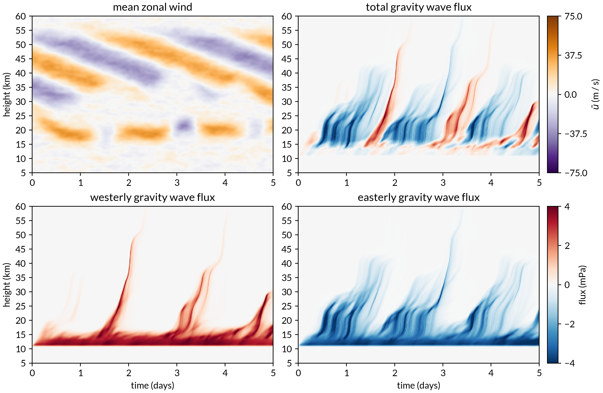

# python-msgwam

This repository is a ray tracing model of internal gravity waves following the
technique of Muraschko et al. (2015), Bölöni et al. (2016, 2021), and Kim et al.
(2021). The theory is based on Achatz et al. (2017, 2022).

The implementation here is quite similar to the implementation of MS-GWaM in
ICON-UA (Bölöni et al., 2021), but is written in Python for ease of use. This
repository also includes various experiments aiming to accelerate that
parameterization, including machine learning approaches.

## From the command line

The ray tracer can be started by calling the `msgwam` directory as a module. You
must pass a path to a configuration TOML file. For example
```
mkdir -p data/example/input
mkdir -p plots/example

python -m acceleration config/example.toml save-mean-state:gated-oscillation
python -m msgwam config/gaussians.toml
```
will save the integration output to `data/example/integration.nc` and a plot
to `plots/example/integration.png`. For details on the various configuration
options, consult `config.py`.

The figure above shows a fairly high-resolution integration of the model and was
produced by `plot_integration` in `plotting.py`.

## From Python code

If this repository is in your Python path, you can import from this module and
call the ray tracer in your own code. For example
```python
from msgwam import config
from msgwam.integration import integrate

config.load('path/to/config.toml')
ds = integrate()
```
will create an `xarray.Dataset` object containing the integration output. Of
course, other components of the ray tracer can also be imported, for more
fine-grained control. Of particular interest may be the `override` context
manager, which allows for temporary changes to the loaded configuration.
```python
config.load('path/to/config.toml')
with config.override(dt=30, n_max=500):
    ds = integrate()
```

## License
The code is licensed under the Creative Commons Attribution 4.0 license. For
more info see https://creativecommons.org/licenses/by/4.0/
