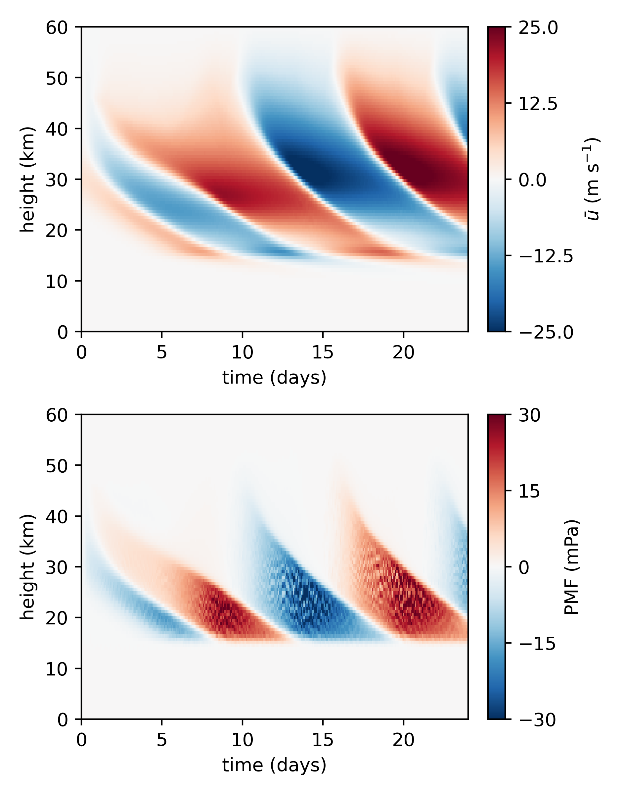

# python-msgwam

Python ray tracer for internal gravity waves following the technique of Muraschko et al. (2015), Bölöni et al. (2016, 2021) and Kim et al. (2021). The theory is based on Achatz et al. (2017) and Achatz (2022).

## Getting started
To run the ray tracer you will need

- a Python 3.x interpreter
- matplotlib
- numpy

The code can be invoked by calling the `msgwam` directory as a module. You must pass a path to a configuration TOML file. For example
```
python -m msgwam config/oscillation.toml
```
will save the integration output to data/oscillation.nc and a plot to plots/oscillation.png.

Several configuration files are provided in the `config` directory.

The function `plot_integration` in `plotting.py` can plot integrator output as below.

There is also `animate.py`, a utility for animating ray volume and mean flow behavior.

## License
The code is licensed under the Creative Commons Attribution 4.0 license. For more info see
https://creativecommons.org/licenses/by/4.0/
